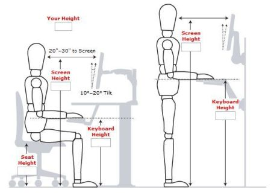

Hulotte - Your health friend
===

Clickez [ici](README_fr.md) pour la version en français.

> Hulotte is currently in alpha version

## Taking care of your eyes

### Some rest
Screens are a big cause of myopia for digital workers. To take care of them, you should apply the 3-20 rule by looking at a point 20 meters away for 20 seconds every 20 minutes to relax your eyes. Hulotte will help you remember this!

> Tips : for those who work in an environment without 20 meters clearance, put a mirror behind your screen to artificially increase the distance!

### Keep your distance
It is strongly advised to keep a distance of at least 50 centimeters between your computer screen and your eyes, as well as on your smartphone and laptop, see the section [A healthy workstation](#a-healthy-workstation) for more information.

## Taking care of your health

### Do some exercises

Extremely sedentary lifestyle can be the source of cardiovascular diseases, cancers, obesity, tension, stress, etc... Make sure you do regular physical exercises! It is recommended to take at least 10,000 steps a day to stay fit and healthy.

### Get up regularly

To stimulate the blood flow in your body, it is highly recommended to take at least a few steps every hour. Take the opportunity to do some stretching and warm-up exercises. Hulotte will help you remember this!

## A healthy workstation

Point to remember:
 - Keep a distance of 50 to 75 cm between your eyes and your screen
 - The top of your screen should be at eye level
 - Your gaze should be perpendicular to your screen
 - Keep your back straight and your shoulders relaxed
 - Keep as much as possible a 90° angle between your arm and your forearm
 - Your keyboard should be at the same height as your elbow
 - Keep your keyboard flat (unless you have difficulty typing)
 - Make sure your knees are between 90° and 120°.
 - Make sure your feet are at a 90° angle to your legs, use a foot brace if you feel the need
 - Do not cross your legs
 - Do not work from your couch
 - If you are a home worker, take the time to get out of the house at least 30 minutes a day