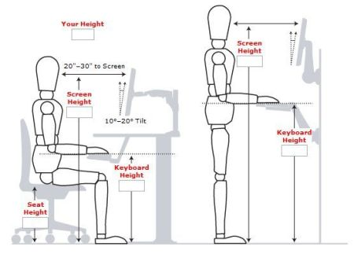

Hulotte - Votre ami santé
===

Click [here](README.md) to get to the English version.

> Hulotte est actuellement en version alpha

## Prendre soin de vos yeux

### Du repos
Les écrans sont une grosse cause d'apparition de myopie pour les travailleurs du numérique. Pour prendre soin d'eux au mieux, il faut appliquer la règle des 3-20, c'est-à-dire, regarder un point à 20 mètres pendant 20 secondes toutes les 20 minutes pour détendre vos yeux. Hulotte vous aidera à vous en souvenir !

> Astuce : pour ceux qui travaillent dans un environnement sans dégagement de 20 mètres, mettez un miroir derrière votre écran pour augmenter artificiellement la distance à laquelle vous regardez !

### Garder ses distances

Il est fortement conseillé de garder une distance d'au moins 50 centimètres entre votre écran d'ordinateur et vos yeux, de même sur votre smartphone et votre ordinateur portable, allez voir la section [Un poste de travail sain](#un-poste-de-travail-sain) pour plus d'informations.

## Prendre soin de votre santé

### Faire de l'exercice

La sédentarité extrême peut être la source de maladies cardio-vasculaire, de cancers, d'obésité, de tension, de stress, etc ... Veillez à faire des exercices physiques réguliers ! Il est conseillé de faire au moins 10 000 pas par jour pour se tenir en forme et en bonne santé.

### Se lever régulièrement

Pour stimuler l'afflue sanguin dans votre corps, il est fortement conseillé de faire au moins quelques pas toutes les heures. Profitez-en pour faire quelques étirements et échauffements. Hulotte vous aidera à vous en souvenir !

## Un poste de travail sain

Point à retenir :
 - Gardez une distance de 50 à 75 cm entre vos yeux et votre écran
 - Le haut de votre écran doit être à hauteur de vos yeux
 - Votre regard doit être perpendiculaire à votre écran
 - Gardez votre dos droit et les épaules détendues
 - Gardez le plus possible un angle de 90° entre votre bras et votre avant-bras
 - Votre clavier doit être à la même hauteur que votre coude
 - Gardez votre clavier à plat (sauf si vous avez des difficultés à taper au clavier)
 - Veillez à ce que l'angle formé par vos genoux soit entre 90 et 120°
 - Veillez à ce que vos pieds soient à un angle de 90° avec vos jambes, utilisez un calle-pied si vous en ressentez le besoin
 - Ne croisez pas les jambes
 - Ne travaillez pas depuis votre canapé
 - Si vous télétravaillez, prenez le temps de sortir de chez vous au moins 30 minutes par jour
